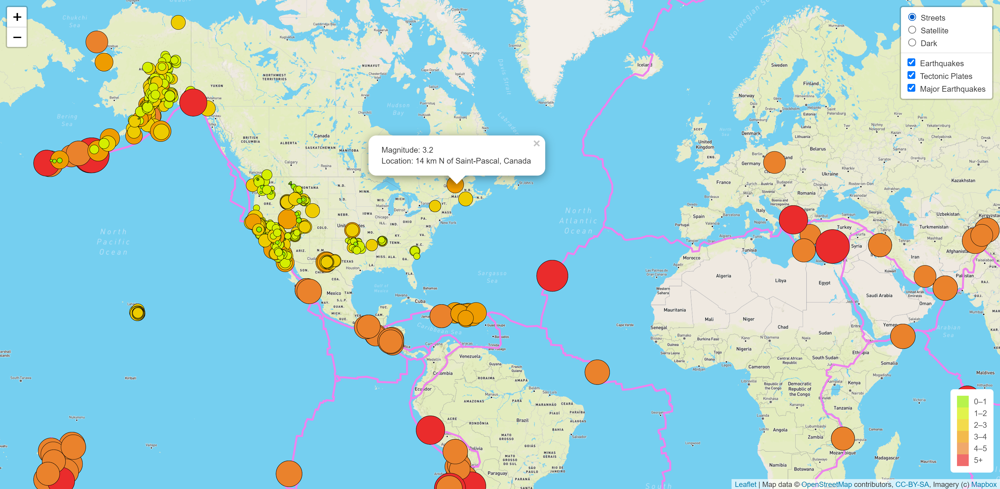
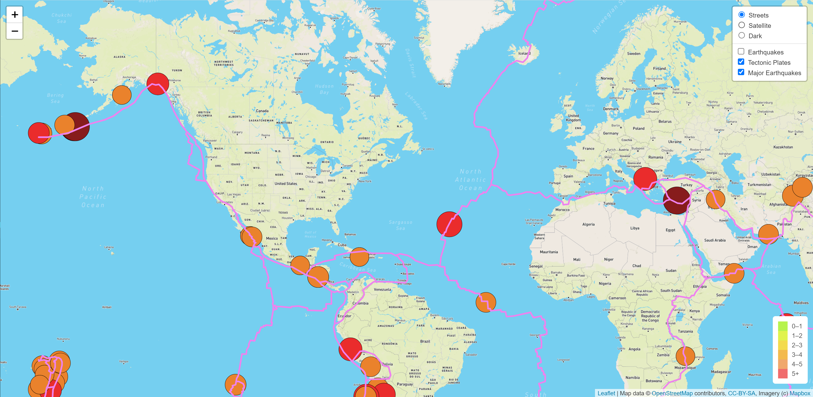

# Mapping Earthquakes
## Project Overview
The goal of this project was to create a dashboard that would display both global earthquake data and tectonic plate boundaries. 

Using the dashboard, a user can:
- Toggle between three different map backgrounds
- Display any of the following:
    - All earthquakes within the last 7 days 
    - Major earthquakes in the last 7 days 
    - Tectonic plate boundaries

The markers for the earthquakes are color coded and sized with respect to the earthquakes' magnitudes. If a marker is clicked, a popup appears that displays the magnitude and location information for the earthquake. 

## Resources
- Languages: JavaScript, HTML, CSS
- Libraries: Leaflet, D3, Mapbox
- Data Sources: 
    - [All Earthquakes](https://earthquake.usgs.gov/earthquakes/feed/v1.0/summary/all_week.geojson) 
    - [Tectonic Plates](https://raw.githubusercontent.com/fraxen/tectonicplates/master/GeoJSON/PB2002_boundaries.json)
    - [Major Earthquakes](https://earthquake.usgs.gov/earthquakes/feed/v1.0/summary/4.5_week.geojson)

## Result
**All Earthquakes**  
   

**Only Major Earthquakes** 
